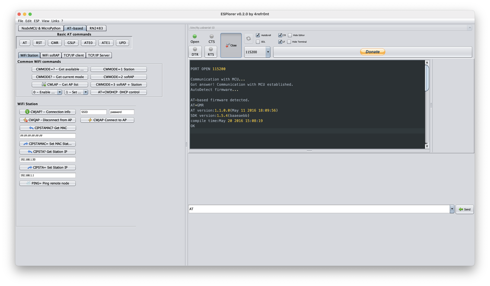

# Описание

Здесь содержится только бинарник, пересобранный под M1 по инструкции автора. Оригинальный проект здесь: https://github.com/4refr0nt/ESPlorer

# Мотивация

При попытке запуска ESPlorer 0.2.0 на macbook M1 появляется ошибка, связанная с невозможностью загрузки библиотеки `jssc`:

```
Exception in thread "AWT-EventQueue-0" java.lang.UnsatisfiedLinkError:
Could not load the jssc library: Couldn't load library library jssc
```

После пересборки под М1 эта проблема пропадает, причём, и на mac mini с процессором Intel начинают отображаться даже те порты, которые ранее не были доступны. Видимо, это связано с тем, что сборщик подтягивает свежую версию `jssc` при сборке.

# Установка и использование

1. Распаковать в удобное место.
2. Сделать файл `ESPlorer.command` исполняемым
   ```
   chmod +x ESPlorer.command
   ```
3. Можно создать псевдоним (ярлык) для него на рабочий стол, запускать и радоваться.
